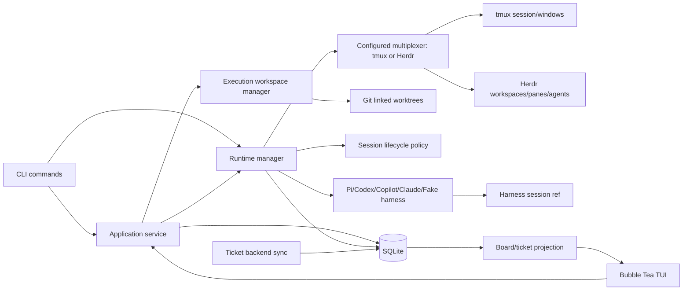
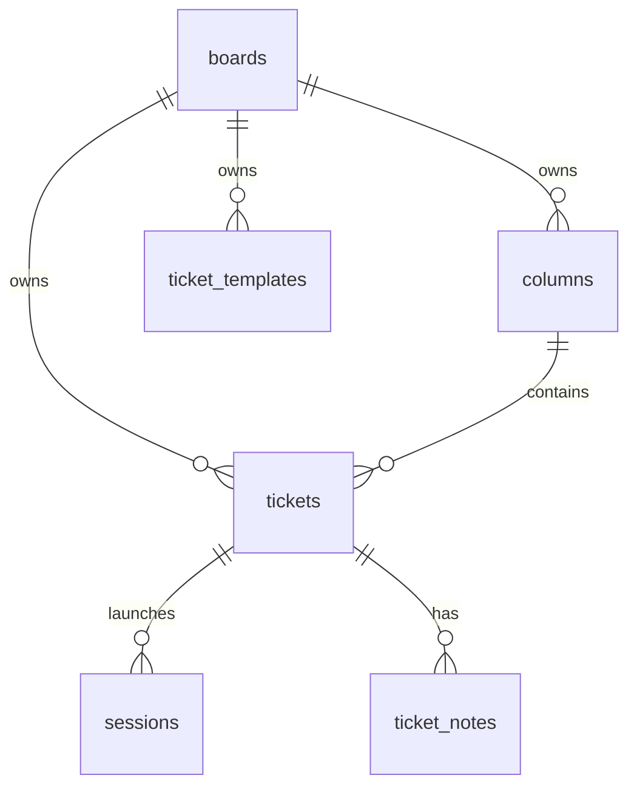
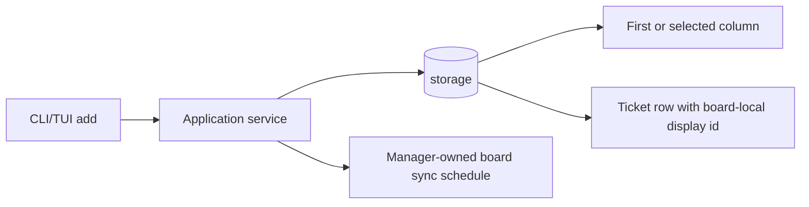
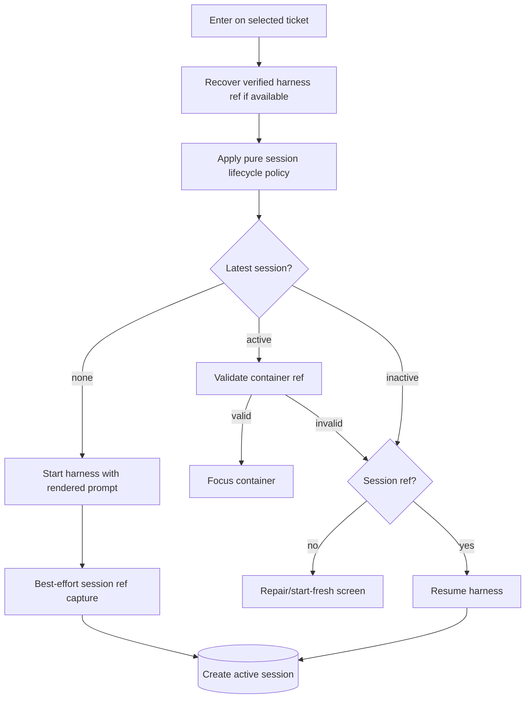
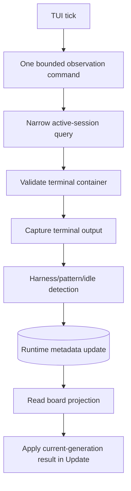

# Architecture

Kanbi is a Go/Bubble Tea TUI and CLI for supervising multiple resumable agent sessions across one or more kanban boards. The application keeps durable state in SQLite and uses a multiplexer runtime backend; tmux remains the default backend and Herdr is supported as an opt-in backend.

## Core Model



- **SQLite is canonical durable state for local boards and runtime/session state.** Tickets, columns, boards, session history, provider-note tombstones, cross-process sync leases, remote push pending tokens, and redacted runtime/sync diagnostics live there; the implemented GitHub and Atlassian/Jira backends own their boards' ticket metadata, which is cached/projected through SQLite. File databases use WAL mode and a busy timeout for concurrent Kanbi processes. Board, Focus, note, and integration projection reads use a separate read-only, query-only connection so a writer waiting for a lock does not monopolize their connection; private in-memory stores keep one connection. Foreign-key enforcement is enabled on every store connection and integrity is verified during initialization.
- **The configured multiplexer is observed runtime state.** tmux windows are validated against live tmux. Herdr containers are stored as workspace/agent/pane metadata and Herdr-native agent state is preferred when available, with pane-output detection as fallback.
- **Harnesses are compiled adapters.** v1 intentionally does not support arbitrary user-defined harness adapters.
- **The TUI is a projection plus command surface.** It renders board/session state and dispatches lifecycle actions. The CLI retains inline rendering and allows up to 120 FPS. A small licensed textarea patch preserves Bubbles v1 editor semantics while avoiding offscreen styling and repeated printable-ASCII width scans; its upstream and differential regression suites live in `internal/tui/textarea`.
- **Ticket backend adapters are board-scoped.** Each board has exactly one ticket metadata backend chosen at creation. `local`, `github`, and `atlassian` (Jira) are implemented today; the adapter seam remains prepared for Asana and similar systems.


Board projections use an eight-entry cache with a 64 MiB estimated snapshot budget. Every read leases one physical SQLite reader and checks its connection-local database revision; replacement connections invalidate the cache. Private in-memory stores also check own-connection changes and schema changes. A revision check after a fresh load prevents retaining a projection that crosses a commit. Admission requires a second read of the same key at the same revision, so continuously changing boards avoid retained-copy work. Callers receive independent mutable slices/checkpoints. External CLI writes, notes, workspace updates, and lifecycle heartbeats continue invalidating snapshots; this cache introduces no freshness TTL. Filter keys above 16 KiB bypass retention.

## Current Objective And Scope

Keep Kanbi a trustworthy beta for multi-board ticket/session lifecycle management across Pi, Codex, Copilot, Claude, and fake harnesses. tmux remains the default runtime backend; Herdr support is opt-in through multiplexer config.

Maintain these behaviors as boring, reliable, documented beta behavior:

- starting a ticket creates exactly one active session attempt;
- opening an active ticket focuses the right terminal container;
- closed/error sessions remain visible as meaningful ticket state;
- stale terminal container ids never attach one ticket to another ticket's session;
- resumable sessions use the correct harness-native resume command;
- unresumable sessions route through repair/start-fresh without corrupting history;
- each board owns its ticket numbers and working directory;
- Master aggregates tickets across boards by workflow key without changing ticket ownership;
- each harness has clearly documented behavior and verification coverage.

Current follow-up work is tracked as tickets on the board. Known focus areas are docs reconciliation, runtime detection confidence, TUI readability/attention styling, board deletion/archive/export semantics, and possible canonical column types for Master aggregation.

## Stop Conditions

Stop and ask before:

- changing current project scope;
- deleting, rewriting, or flattening ticket/session history;
- making real harness behavior assumptions that cannot be tested locally;
- adding a persistent background process;
- changing supported harness command names;
- making any harness appear resumable without a stored or user-provided session ref;
- removing tmux as the default runtime backend.

## Package Map

| Path | Responsibility |
| --- | --- |
| `cmd/kanbi` | CLI entrypoint, command parsing, target resolution, output formatting, board startup, doctor command, and command surfaces. Ticket/note mutations use `internal/app`; direct runtime edges remain only for command surfaces without an app use case. |
| `internal/app` | Presentation-independent board, ticket, note, and session use-case orchestration, including post-save runtime effects and manager-owned mutation sync scheduling. |
| `internal/boardruntime` | Starts the board process in the configured runtime, including Herdr availability, workspace, pane, environment, and attach orchestration. |
| `internal/config` | Config loading, XDG/env path resolution, and applying built-in harness defaults from `internal/harness`. |
| `internal/buildinfo` | Release-injected semantic version, commit/build metadata, Go platform, and schema compatibility reporting. |
| `internal/diagnostics` | Opt-in bounded private log writer and redacted support-bundle collection (`kanbi-support-bundle`). |
| `internal/archiveutil` | Policy-free symlink-aware path containment, bounded ZIP reads, and regular-file extraction safety shared by archive formats. |
| `internal/backup` | Versioned full SQLite-and-attachments export/restore archives (`kanbi-backup`) with validation. |
| `internal/boardpackage` | Versioned single-board packages (`kanbi-board-package`) with path-safe attachments, preview, create-new import, and compensating rollback. |
| `internal/storage` | SQLite adapter split by boards, ticket templates, tickets, columns, sessions, notes, remote sync, projections, schema, and migrations. Includes board archive/sync flags, workflow keys, filter presets, and board aggregate load/import. `TicketProjection` and `ColumnView` are explicit read models. |
| `internal/session` | Provider-neutral lifecycle policy and errors, durable session repository contract, and compiled-in multiplexer registry. |
| `internal/workspace` | Multiplexer-neutral Git repository inspection, branch/worktree provisioning and validation, status observation, conflict resolution primitives, repository flock, and conservative cleanup. |
| `internal/integration` | Repository-scoped integration runs: exact source/ticket snapshots, managed integration checkout and prompt, token-authenticated agent reports, independent candidate verification, serialized promotion, and ticket-workspace retirement. |
| `internal/ticketbackend` | Board-scoped ticket metadata backend registry and owned startup/periodic/mutation sync orchestration (cancel + WaitGroup drain). Providers receive a narrow sync repository. Implements timeouts, GET retry classification, durable find-or-link create recovery, the no-op `local` backend, GitHub Issues sync, and Atlassian/Jira sync. |
| `internal/multiplexer` | Provider-neutral runtime container concepts and interface for launch/focus/read/send/close/detect operations. Includes the Herdr adapter under `internal/multiplexer/herdr`. |
| `internal/tmux` | tmux adapter and compatibility runtime manager. Launch execution, runtime polling, and reconciliation remain here while lifecycle policy lives in `internal/session`. |
| `internal/harness` | Localized built-in harness contracts, command construction, prompt mode/ref capture behavior, output/runtime detection helpers. |
| `internal/tui` | Bubble Tea model/update/view, keybindings, board picker, cards, filters, repair/prompt fallback screens, status-bar scheduling, and terminal-gated image previews. |
| `internal/statusbar` | Starship-style status modules, three-zone layout, configuration validation, and bounded custom-command execution. |
| `internal/prompt` | Ticket body/prompt rendering. |
| `internal/attachments` | XDG data-dir ticket attachment storage and pasted image detection. |
| `internal/architecture` | Dependency-boundary tests that keep presentation and concrete runtime adapters out of inward-facing packages. |
| `scripts/` | Development launcher, native release snapshot builder, deterministic smoke tests, fake harnesses, opt-in real harness lifecycle script. |
| `docs/` | Source-of-truth docs for state, lifecycle, harness contracts, verification, multi-board behavior, and archived product context. |

## Runtime Topology

Kanbi uses the configured multiplexer as its runtime substrate. tmux is the default implementation and uses sessions per board executable instance:

```text
tmux session: kanbi-board-<pid>-<time>-1
windows:
  board
  <board-id>-T-001-some-ticket
  <board-id>-T-002-another-ticket

tmux session: kanbi-board-<pid>-<time>-2
windows:
  board
  <board-id>-T-003-other-ticket
```

The board process runs in the stable `board` window of its instance session. Each active ticket session gets its own tmux window in the runtime session owned by the board instance that launched it. The app uses windows, not panes, for ticket sessions.

When tmux is the configured multiplexer and Kanbi is launched outside tmux, the CLI creates a unique board/client tmux session and sets that same session as the ticket runtime for the inner board process. When Herdr is the configured multiplexer and Kanbi is launched outside Herdr, the CLI starts the board UI in a focused Herdr pane and attaches to Herdr; when already inside Herdr, it runs the board directly to avoid nesting. When launched directly inside tmux without an explicit `KANBI_TMUX_SESSION`, the current tmux session is used as that executable's runtime for tmux-backed sessions. `KANBI_INNER=1` prevents recursive multiplexer launching.

Session rows persist generic multiplexer container fields (`multiplexer`, `mux_namespace`, `mux_container_id`, `mux_container_name`, `mux_metadata`) plus legacy tmux fields for tmux sessions. Other Kanbi instances can see these rows through SQLite and validate/switch/capture/close using the stored container reference instead of assuming their own runtime session.

## Durable Data Relationships



- A **board** owns columns, display numbering, a working directory, and exactly one implemented ticket metadata backend. Board names are unique without regard to case.
- The **Master board** is a synthetic all-boards view; it is not a stored board row.
- A **ticket template** is board-scoped local metadata containing a reusable name, title seed, literal body, and supported harness. Application snapshots those values into an ordinary ticket; provider sync never owns templates and existing tickets are never linked back.
- A **ticket** is durable work metadata: non-blank title, body, supported harness preference, workflow column, archive status, and local Focus Mode pause state. A ticket may move only between columns owned by its board. Append-only pause checkpoints preserve every pause/resume handoff independently of provider metadata and runtime state.
- Column names are unique by exact spelling within a board. Master aggregation matches column `workflow_key` values (defaulted to each column's display name at creation; rename does not change the key). At most one column per workflow key is allowed on a board.
- External ticket and note identities are unique within their owning board/ticket so sync never has to choose an ambiguous local row.
- A **workspace** is a durable ticket-owned execution checkout. Git-worktree boards retain workspace intent/history independently of terminal sessions; at most one workspace is current per ticket. Integration retires only the linked checkout while retaining its branch, stable path, and session continuity; reopening rehydrates the exact path.
- A **session** is one attempt to run an agent for a ticket and snapshots its nullable workspace id and launch directory.
- **Ticket notes** are durable notes per ticket; local-board notes remain personal/local, while the GitHub and Atlassian/Jira backends map notes to provider comments.
- An **active session** is a session believed to own a live terminal container, but it must still pass validation before being trusted.
- A **terminal container** is the live process container for an active session: a tmux window for tmux, or a Herdr pane/agent for Herdr.
- A **harness session ref** is the harness-native resume handle when the harness exposes one.
- **Start fresh** creates a new active session attempt while preserving prior session rows.

See [`docs/multiplexer-contracts.md`](./multiplexer-contracts.md) for the tmux/Herdr adapter contract and [`docs/tmux-to-herdr-migration.md`](./tmux-to-herdr-migration.md) for recommended migration semantics when changing existing boards from tmux to Herdr. See [`docs/multi-board-behavior.md`](./multi-board-behavior.md) for board aggregation and Master view behavior. See [`docs/ticket-backends.md`](./ticket-backends.md) for the board-scoped ticket backend model.

## Ticket/Session Lifecycle Invariants

These are core architecture rules, not optional implementation details:

1. Only one active session per ticket is allowed.
2. Starting fresh deactivates any old active session and creates a new session row; it must not delete old session history.
3. Opening an already-active valid window switches to it without creating a new session row.
4. A stored terminal container id is valid only when the configured multiplexer validates it. For tmux, a stored window id is valid only when live tmux still reports that id with the expected ticket window name; name-based fallback must target the session row's stored tmux session name.
5. Inactive latest sessions project as terminal states such as `closed` or `error`, not `not_started`.
6. `send prompt` is allowed only for never-started tickets.
7. Repair/start-fresh flows must preserve history and avoid silently attaching a ticket to the wrong live window.
8. Real harness session refs must come from verified local evidence, not assumptions.
9. Global Focus Mode admissions serialize in SQLite across boards/processes; provider sync may exceed capacity but must preserve its authoritative workflow transition.
10. Pausing an active ticket validates the checkpoint and closes/confirms the runtime session before atomically recording paused state; checkpoint history is never flattened.

For the full state model, read [`docs/state-management.md`](./state-management.md) and [`docs/ticket-session-lifecycle.md`](./ticket-session-lifecycle.md).

## Command/Data Flows

### Add Ticket



CLI parsing resolves the board and column and formats the resulting projection; the application service performs ticket creation, update, move, and note mutation orchestration. This keeps CLI mutations aligned with TUI validation, live-window rename ordering, and exactly-one board sync scheduling.

### Default Ticket Action



### Runtime Refresh



The TUI starts one runtime observation command at a time, with a 1.5-second context deadline, then schedules the next tick two seconds after completion. Input and View continue while it runs. A request snapshots the board/filter generation; results from an older foreground reload are discarded. Polling errors keep the last valid board visible with a stale-refresh footer. Editor drafts belong to the UI thread and are not replaced by observation results. Shutdown cancels and joins started observation work before closing storage.

Successful Git workspace observations are cached for five seconds by workspace identity, state, path, and source branch. The 750 ms Git observation budget rotates across workspaces so a slow prefix cannot indefinitely starve the remainder. Failures are retried; explicit resolve/integrate operations still observe and revalidate fresh state. Unchanged workspace status does not write or advance `updated_at`; session liveness/output timestamps retain their existing semantics.

Card previews and note Markdown have bounded, per-model caches keyed by content and width. Notes render a bounded window beginning at the selected note; all notes remain reachable with j/k. The notes tab uses a compact cached description preview so a long body cannot hide the selected note. Saves retain the changed note selection and deletion follows the adjacent note; entering the compact tab clears previously displayed Kitty graphics. Modal background caches include projection version, geometry, selection, footer state, and elapsed-time second. Ordinary navigation and refresh preserve vertical viewport anchors; only a resize backfills spare space. Terminal environment probes cache positive and negative results for 30 seconds per tmux/pane context and bound each subprocess to 100 ms. Plain inspector dismissal does not probe graphics capabilities when no Kitty image was displayed.

The inspector's read-only description wraps only its visible rows plus one lookahead row for the overflow ellipsis. Ordinary text without either possible image marker skips image regex scans; valid Markdown image paths without extensions still render. The editable textarea retains Bubbles' full cursor/edit behavior.

## Harness Architecture

Built-in harness contracts are localized in `internal/harness`: command defaults, prompt mode, exit keys, ref capture, and docs anchors are grouped per supported harness. `internal/config` applies those defaults and preserves YAML overrides. `internal/session` owns the pure lifecycle decision table, while the compatibility runtime manager in `internal/tmux` still executes launches across tmux and Herdr adapters. Current supported harnesses:

| Harness | Start with prompt | Resume | Ref source |
| --- | --- | --- | --- |
| Pi | `pi <prompt>` plus bundled ref extension and explicit `Enter` | `pi --session <ref>` | extension handoff, fallback session JSONL scan |
| Codex | `codex --no-alt-screen <prompt>` | `codex resume --no-alt-screen <ref>` | `~/.codex/history.jsonl` |
| Copilot | `copilot -i <prompt>` | `copilot --resume=<ref>` | `~/.copilot/session-store.db` |
| Claude | `claude <prompt>` plus explicit `Enter` | `claude --resume <ref>` | `~/.claude/projects/**/*.jsonl` |
| Fake/smoke | script-dependent | script-dependent | pane marker such as `SESSION_REF=` |

Always update [`docs/harness-contracts.md`](./harness-contracts.md) when harness behavior changes.

## Where To Make Common Changes

| Task | Likely files | Required doc updates |
| --- | --- | --- |
| Add/change CLI command | `cmd/kanbi/main.go`, command tests | `README.md` if user-facing |
| Change config/defaults | `internal/config/*` | `README.md`, possibly `docs/harness-contracts.md` or `docs/multiplexer-contracts.md` |
| Change schema/storage behavior | `internal/storage/*` | `docs/state-management.md` or lifecycle docs |
| Change ticket/session lifecycle | `internal/tmux/*`, `internal/storage/*`, `internal/tui/*` | `docs/state-management.md`, `docs/ticket-session-lifecycle.md` |
| Change harness command/ref capture | `internal/harness/*`, `internal/config/*`, `internal/tmux/*` | `docs/harness-contracts.md` |
| Change card rendering/keybindings | `internal/tui/model.go`, `internal/tui/model_test.go` | `README.md` or a controls doc if user-facing |
| Change multi-board behavior | `internal/storage/*`, `internal/tui/*`, CLI board commands | `docs/multi-board-behavior.md`, `README.md` |
| Change verification process | `scripts/*`, tests | `docs/autonomous-verification.md`, `AGENTS.md` if onboarding changes |

## Schema Evolution

SQLite schema changes are applied through the ordered `schema_migrations` ledger. Migration runners serialize through a database write lock, apply pending migrations atomically, and record a version only in the transaction that successfully applied it. Existing pre-ledger databases enter through the idempotent legacy compatibility migration; no ticket or session history is flattened or deleted. Kanbi refuses to open a database created by a newer unsupported schema version or one that fails SQLite's foreign-key integrity check.

Indexes used by board projection, latest-session lookup, external identity lookup, and note listing are installed by migration. Provider sync uses expiring, per-board SQLite leases so multiple Kanbi processes cannot concurrently create the same remote ticket; leases renew while work continues, cancel the attempt if lost, are released after sync, and abandoned leases recover after expiry. Mutation-triggered scheduling storms are coalesced per board into the active sync plus at most one follow-up sync, preventing unbounded waiting goroutines while preserving a mutation that arrives during active work. Remote issue create is further protected by durable pending push tokens and find-or-link recovery rather than blind re-POST. Provider-backed note deletion preserves a tombstone so comments that remain remote are not re-imported. Domain uniqueness constraints must only be added with an explicit compatibility strategy for existing durable history.

## Testing Strategy

- Prefer fast deterministic unit/model/storage tests.
- Use fake harnesses for automated lifecycle coverage.
- Keep real harness tests opt-in because they can consume quota and depend on auth/local history.
- Tmux tests must isolate session names and clean up immediately.
- After meaningful changes, follow the verification loop in [`AGENTS.md`](../AGENTS.md) and [`docs/autonomous-verification.md`](./autonomous-verification.md).

## Release And Compatibility

The canonical module path is `github.com/carlotran4/kanbi`. Supported stable/beta/RC tags trigger native CGO builds on Linux and macOS for amd64 and arm64. Every native runner validates the exact binary's provenance, database backup/restore, and fake-harness lifecycle before a four-archive checksummed bundle can publish. All `v0.x` and suffixed tags publish as prereleases; stable major versions are workflow-locked until qualification approval. Release metadata is injected into `internal/buildinfo`, and archives include the binary/README/license/`BUILDINFO.json`. Database migrations are forward-only: older binaries refuse newer schema versions, so rollback requires restoring a pre-upgrade backup. See [`docs/release-channels.md`](./release-channels.md), [`docs/installation.md`](./installation.md), [`docs/compatibility.md`](./compatibility.md), and [`docs/release-checklist.md`](./release-checklist.md).

Operations support tools (`kanbi doctor`, opt-in diagnostics logging, `kanbi support-bundle`) are documented in [`docs/support.md`](./support.md).
