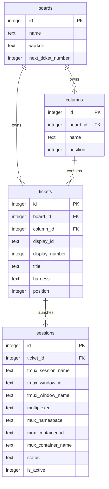
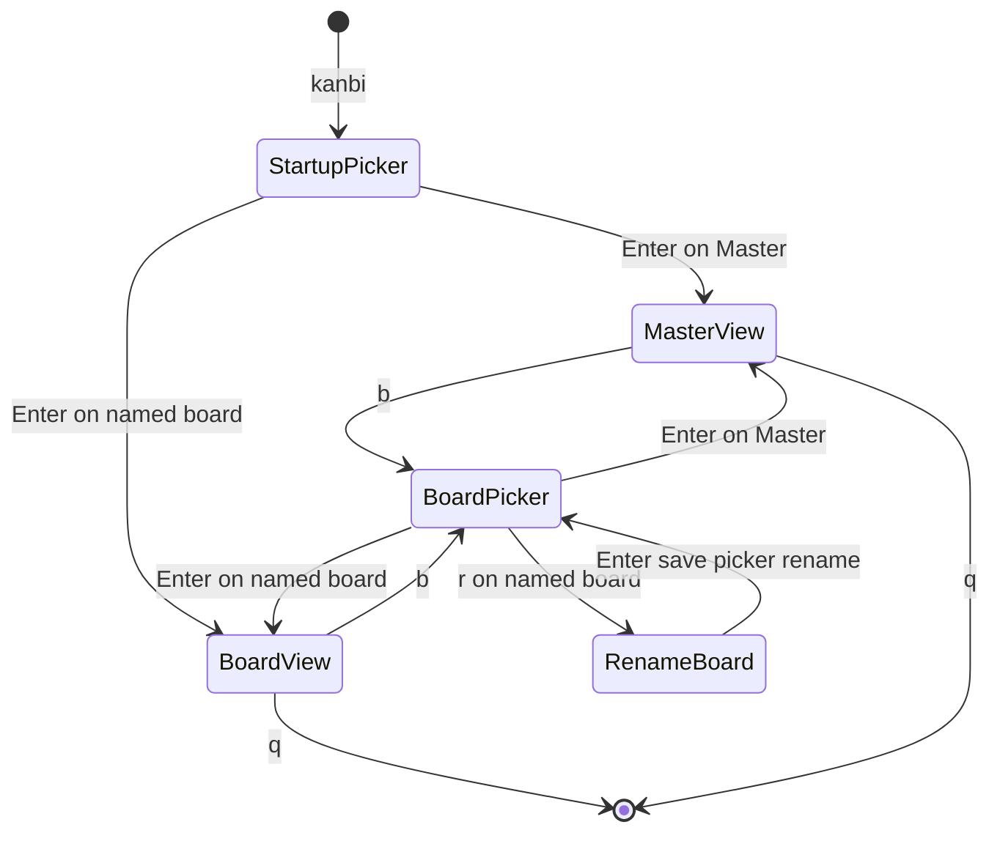
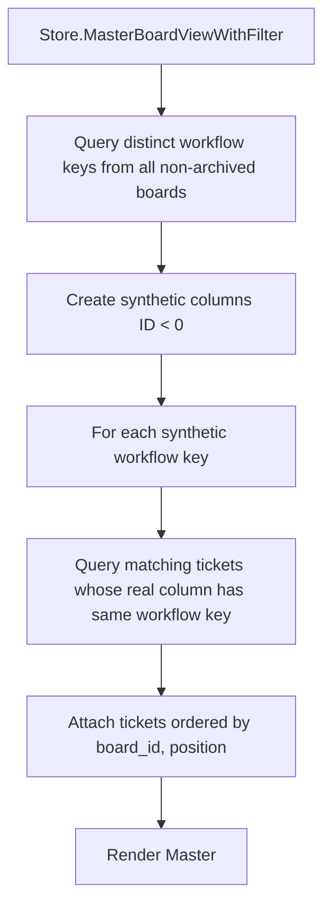
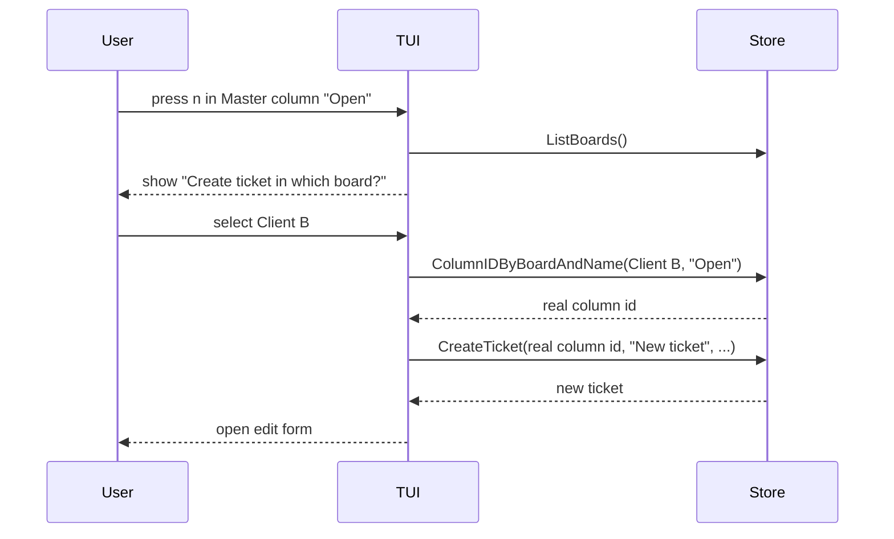
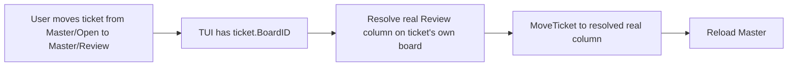
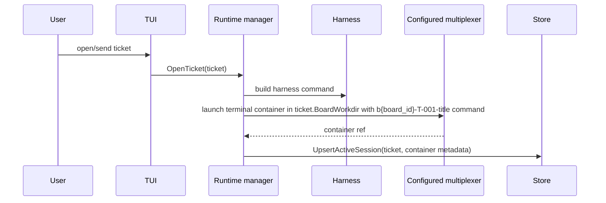

# Multi-Board Behavior Overview

## Purpose

Multi-board support lets one `kanbi` database hold multiple logical boards, each with its own working directory. A `Master` board aggregates tickets across boards so the user can supervise all active work from one place.

## Core concepts



- A board owns columns, ticket numbering, a working directory, and exactly one implemented ticket metadata backend chosen at creation. Board names are unique without regard to case.
- Column names must be unique by exact spelling within one board. Master grouping, creation, and movement use free-form `workflow_key` values (defaulted to the column's exact current display name at creation time). Renaming a column's display name does not change its workflow key. At most one column per workflow key is allowed on a board.
- Tickets cannot be moved to columns owned by another board; Master moves resolve a destination on the ticket's existing board.
- `display_id` values are unique only within a board, so multiple boards can have `T-001`.
- A ticket projects its owning board metadata into TUI/storage reads as `BoardName` and `BoardWorkdir`.
- `Master` is synthetic: it is not stored as a row in `boards` and has no real columns.

## Board selection and switching



Startup opens a board picker. While running, `b` reopens the picker and switches without restarting. Board creation explicitly chooses a shared directory or isolated Git worktrees. Inside the board picker: `c` creates a board, `r` renames, `w` updates cwd, `t` opens confirmation to enable Git worktrees on an existing board, `a` archives/unarchives, `s` toggles sync (when not archived), `e` exports a board package, `i` imports a package, `A` shows archived boards, and `d` hard-deletes with exact-name confirmation. Worktree enablement is not a casual toggle: disabling is rejected after workspace history exists. `Master` cannot be renamed or deleted. Archive hides a board and pauses sync without removing tickets, sessions, or attachments. Archiving the currently viewed named board switches the view to Master before the picker can close.

## Master board aggregation



Master groups tickets by column `workflow_key`. Example: every board column keyed `Open` contributes tickets to the synthetic `Open` column even if a board renames the display label. Workflow keys default to the column display name at creation and are preserved across renames. By default Master shows unarchived tickets only.

## Master filters

Press `f` in Master to open the filter panel. Filters apply only to Master; normal named-board views remain unchanged.

Available filters:

- Board: select one or more boards, or select none for the `All Boards` default.
- Runtime/state: every projected state is filterable: `not_started`, `starting`, `running`, `waiting_for_user`, `needs_permission`, `idle_unknown`, `closing`, `closed`, `exited`, `repair_needed`, and `error` (resumable closed tickets show when their latest session projects `closed`).
- Harness: harness names present in tickets, including `pi`, `codex`, `copilot`, and any other stored harness name.
- Search: case-insensitive text search over ticket display id, title, body, board name, and harness.
- Archived: off by default; toggle `show archived` to include archived tickets in Master queries.

Active filters are shown in the Master header as `filter: ...`. Filter-panel edits remain a draft until `Enter` applies them; `Esc` cancels the draft without changing the active filter or Master results. Press `C` in the filter panel to clear all filters. Runtime filters are not auto-applied on process startup. Named presets can be saved (`S`) and applied (`P`) from the filter panel; preset board selection is stored by stable board UUID. Unresolved UUIDs surface as missing boards instead of being silently dropped. Named-board filters remain out of scope.

Master cards include board context:

```text
T-001 [Client B] Implement auth
```

## Creating a ticket from Master



If the selected board does not have a column with the current Master column's workflow key, creation fails with a status message. Kanbi never auto-creates provider columns from Master.

## Moving a ticket from Master



Moves from Master do not change the owning board. They only move the ticket to another column on the same board, resolved by workflow key.

## Opening/sending tickets and working directory flow



The working directory is selected from the ticket's owning board, including when the ticket is opened from Master. For an opted-in Git-worktree board, first start creates a ticket workspace and the terminal container launches in its recorded launch directory; legacy and opt-out sessions continue using the board cwd.

Each board UI executable uses the configured multiplexer as its runtime substrate. With the default tmux implementation, new ticket windows are created in the runtime tmux session for the executable that launched them, and the session row stores that `tmux_session_name`. Other board instances use the stored container reference when validating, switching to, capturing, or closing an already-active ticket session. With Herdr, sessions store Herdr workspace/agent/pane metadata in the generic multiplexer fields.

If `BoardWorkdir` is empty, the configured multiplexer falls back to the current process working directory. Ticket container names include the board ID (`b{board_id}-...`) so duplicate board-local IDs do not collide within a runtime namespace.

## Agent-assisted repository integration

On a named Git-worktree board, `I` lists current ticket workspaces. Clean/ready rows are selectable with `Space`; dirty or repair states remain visible with textual reasons. `Enter` snapshots the selected branch heads and source head, creates a temporary integration checkout, and opens the configured integration agent. A repository/source cohort can have only one active run. Returning to `I` opens that run: `Enter` focuses the agent, `p` confirms a ready candidate promotion, and `x` confirms cancellation. Waiting-for-user, permission, and ready states appear in the board footer. Master integration selection is intentionally unavailable because repository/source grouping would be ambiguous.

## CLI behavior

```text
kanbi boards
kanbi boards list --include-archived
kanbi boards add "Client B" --cwd /path/to/project --worktree-mode git
kanbi boards enable-worktrees "Client B"
kanbi boards rename "Client B" "Client C"
kanbi boards set-cwd "Client C" /path/to/project
kanbi boards archive "Client C"
kanbi boards unarchive "Client C"
kanbi boards enable-sync "Client C"
kanbi boards disable-sync "Client C"
kanbi boards export "Client C" ./client-c.kanbi-board.zip
kanbi boards import ./client-c.kanbi-board.zip --preview
kanbi boards import ./client-c.kanbi-board.zip --name "Client C Copy"
kanbi boards set-column-key "Client C" --column "Code Review" --key review
kanbi add "Title" --board "Client C"
kanbi list --board "Client C"
kanbi open T-001 --board "Client C"
```

Current behavior:

- `boards add` creates a board with default columns (workflow keys equal to display names), a workdir, stable UUID, sync enabled, selected execution policy (`--worktree-mode off|git`, default `off`), and the selected ticket backend. Supported backends are `local`, `github`, and `atlassian`; GitHub boards accept `--config JSON` for owner/repo settings and `--query QUERY` for Issues list filters, while Atlassian/Jira boards use `--query` as JQL and `--config JSON` for site/project settings. The JSON is stored unencrypted in SQLite, so use the documented environment variables for tokens and other credentials.
- `--cwd` defaults to the current directory.
- `boards rename OLD NEW` renames a board.
- `boards set-cwd NAME /path` updates a board workdir.
- `boards archive`/`unarchive` hide or restore a board without deleting history. Archive forces `sync_enabled=0`. Unarchive clears `archived_at` only so provider boards stay paused until `enable-sync`.
- `boards export`/`import` use versioned `kanbi-board-package` zips (not full DB backups). Export rejects active sessions. Import is create-new-only (new integer PKs, remapped FKs, always archived + sync disabled, sessions forced inactive). Name collisions require `--name`. Preview with `--preview` is non-mutating.
- `boards set-column-key` maps a display column onto a Master workflow key without renaming the column.
- `add` creates tickets on the default board unless `--board NAME` is supplied.
- `list` lists tickets across all boards and includes board context; `--board NAME` filters.
- `open T-001` works only if the display ID is unambiguous; use `--board NAME` when duplicate board-local IDs exist.

## Ticket backend sync

Implemented ticket backends are `local`, `github`, and `atlassian`. The architecture stores board-level backend metadata and starts ticket backend sync in the background on startup, then runs it periodically while the executable is running, and on demand with `kanbi sync` or `kanbi sync --board NAME`. Successful TUI ticket metadata saves also trigger a background sync for the ticket's owning board, including newly-created ticket saves, edit saves, move/archive changes, and note/comment saves. The TUI opens from the local SQLite projection and does not wait for remote/cloud providers before rendering. The periodic sync is in-process only and stops when Kanbi exits.

GitHub boards use native issue state for terminal work (`Done`/`Closed` closes the issue) and plain workflow labels such as `in-progress`, `needs-review`, and `blocked` for non-terminal columns. They pull/push issue title/body/state/labels/comments and use newest-updated-at-wins conflict resolution. Atlassian/Jira boards inherit workflow columns from remote issue statuses, use the board `BackendQuery` as JQL, and pull/push issue summary/description/status/comments. Notes map to provider issue comments. Local runtime/session history is never synced to ticket providers.

See [`docs/ticket-backends.md`](./ticket-backends.md).

## Board archive vs delete vs package export

- **Board archive** is non-destructive local hide + sync pause. Tickets, notes, sessions, and attachments remain. Active ticket sessions and active integration runs block archive.
- **Board package export/import** (`kanbi-board-package`) is a single-board portable archive with path-safe attachments and checksum inventory. It preserves the board execution policy, but machine-local live/retained workspaces and active integration runs block export and are never presented as portable checkouts. Completed integration-run history remains available through full database backup rather than the portable board package. It is not a full database backup (`kanbi-backup`).
- **Hard board delete** remains distinct, confirmation-gated, local-only, and cascading. Deletion is blocked with active sessions. Attachment cleanup runs only after the SQL commit. Provider-backed note tombstones and remote issues are never hard-deleted by EG-related local flows.

Kanbi still provides `kanbi backup PATH` / `kanbi restore PATH [--force]` for whole-DB SQLite-plus-attachments archives.

## Known residual gaps / risks

- Free-form workflow keys have no automatic synonym mapping (`review` vs `code-review` stay separate unless mapped intentionally).
- Attachment absolute markdown paths outside package inventory are not rewritten on import.
- Named-board filters and merge-import remain out of scope.
- Synthetic Master labels when many display names share one key use a single representative name.

## Recommended next implementation priorities

1. Optional TUI editor for workflow keys beyond CLI `set-column-key`.
2. Consider attachment markdown path rewrite completeness for absolute package-owned body links.
3. Decide whether named-board views should gain equivalent filter capabilities.
