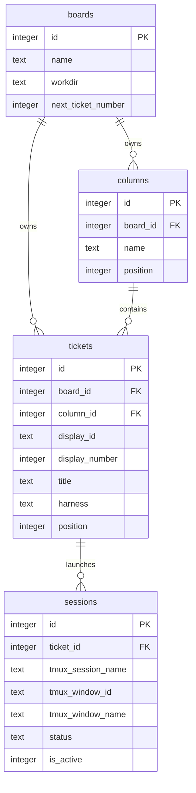
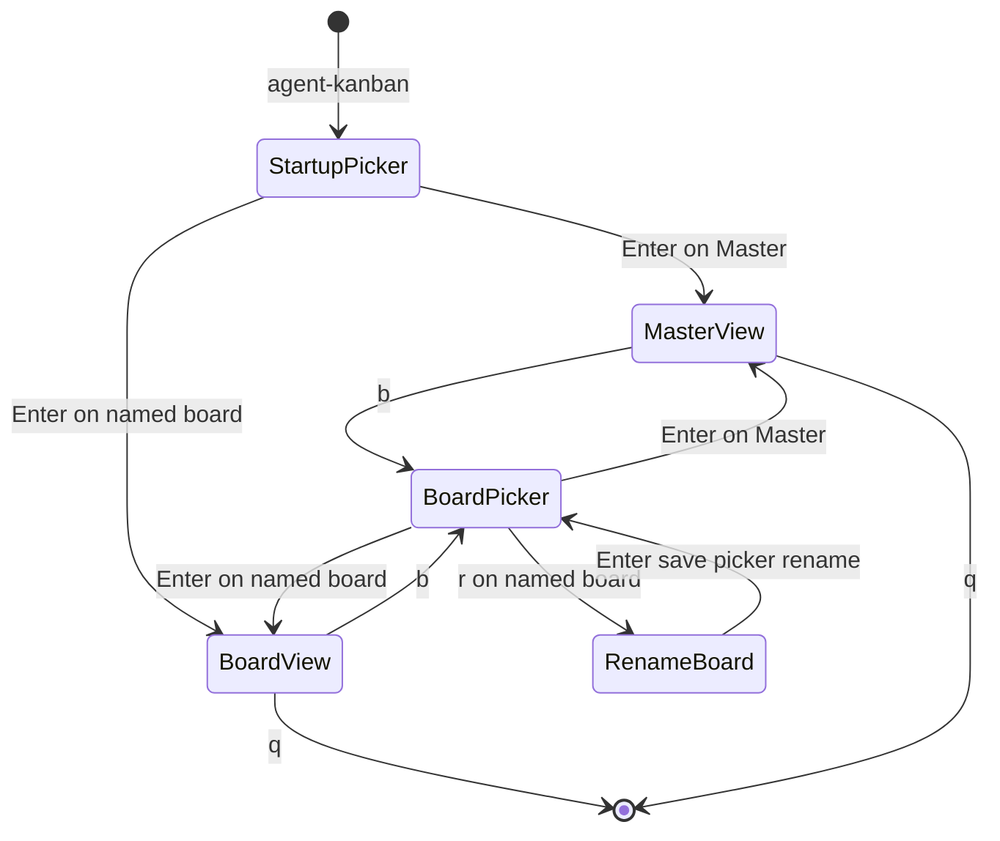
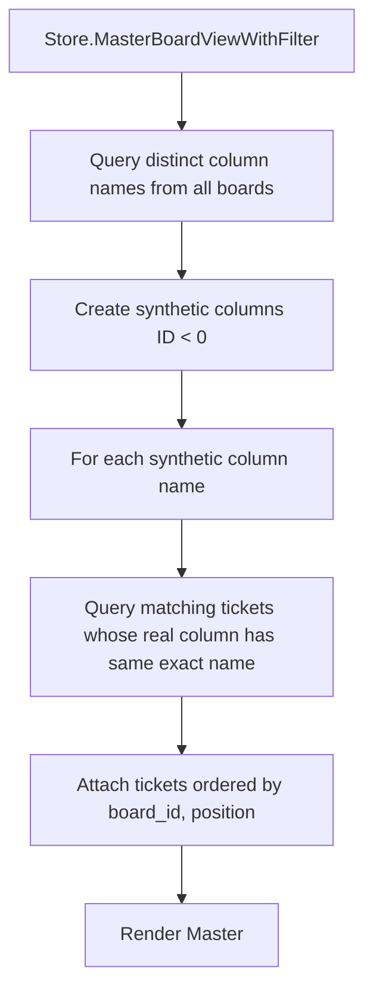
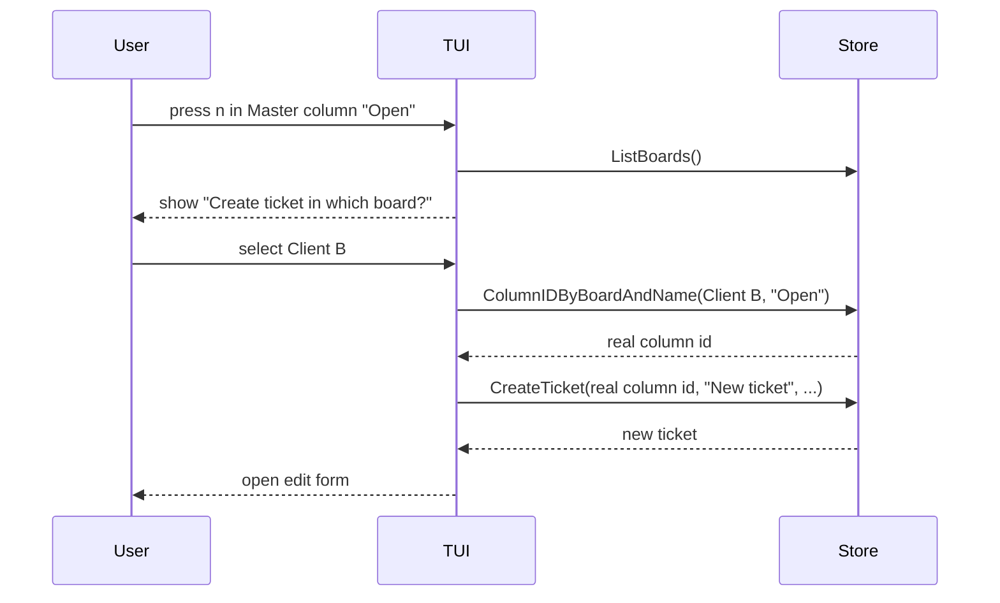
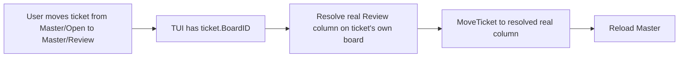
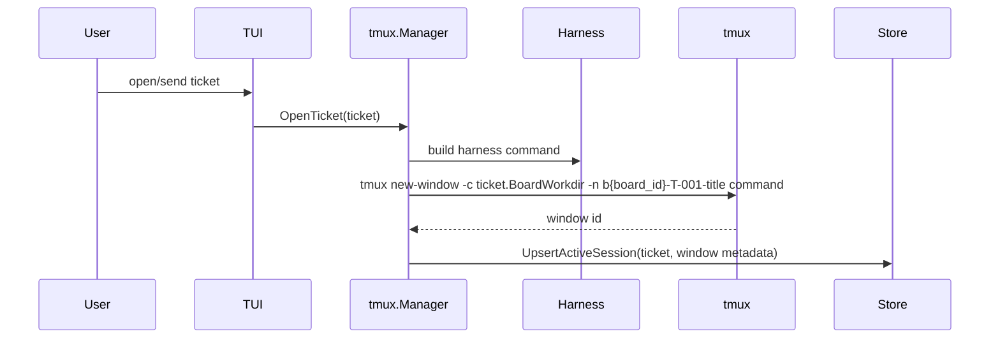

# Multi-Board Behavior Overview

## Purpose

Multi-board support lets one `agent-kanban` database hold multiple logical boards, each with its own working directory. A `Master` board aggregates tickets across boards so the user can supervise all active work from one place.

## Core concepts



- A board owns columns, ticket numbering, a working directory, and exactly one ticket metadata backend chosen at creation.
- `display_id` values are unique only within a board, so multiple boards can have `T-001`.
- A ticket projects its owning board metadata into TUI/storage reads as `BoardName` and `BoardWorkdir`.
- `Master` is synthetic: it is not stored as a row in `boards` and has no real columns.

## Board selection and switching



Startup opens a board picker. While running, `b` reopens the picker and switches without restarting. Inside the board picker, `c` creates a board, `r` renames the selected real board, `w` updates cwd, and `d` deletes. `Master` cannot be renamed or deleted.

## Master board aggregation



Master groups tickets by exact column name. Example: every board's `Open` tickets appear in the synthetic `Open` column. By default it shows unarchived tickets only.

## Master filters

Press `f` in Master to open the filter panel. Filters apply only to Master; normal named-board views remain unchanged.

Available filters:

- Board: select one or more boards, or select none for the `All Boards` default.
- Runtime/state: `not_started`, `running`, `waiting_for_user`, `needs_permission`, `error`, and `closed` (resumable closed tickets show when their latest session projects `closed`).
- Harness: harness names present in tickets, including `pi`, `codex`, `copilot`, and any other stored harness name.
- Search: case-insensitive text search over ticket display id, title, body, board name, and harness.
- Archived: off by default; toggle `show archived` to include archived tickets in Master queries.

Active filters are shown in the Master header as `filter: ...`. Press `C` in the filter panel to clear all filters. Filters are in-memory UI state: they reset on app restart, but persist while switching between Master and named boards during one run.

Master cards include board context:

```text
T-001 [Client B] Implement auth
```

## Creating a ticket from Master



If the selected board does not have a column matching the current Master column name, creation fails with a status message.

## Moving a ticket from Master



Moves from Master do not change the owning board. They only move the ticket to another column on the same board, resolved by column name.

## Opening/sending tickets and working directory flow



The working directory is selected from the ticket's owning board, including when the ticket is opened from Master.

Each board UI executable has its own runtime tmux session by default. New ticket windows are created in the runtime session for the executable that launched them, and the session row stores that `tmux_session_name`. Other board instances use the stored tmux session name when validating, switching to, capturing, or closing an already-active ticket session.

If `BoardWorkdir` is empty, `tmux` falls back to the current process working directory. Ticket tmux window names include the board ID (`b{board_id}-...`) so duplicate board-local IDs do not collide across boards within a runtime session.

## CLI behavior

```text
agent-kanban boards
agent-kanban boards add "Client B" --cwd /path/to/project
agent-kanban boards rename "Client B" "Client C"
agent-kanban boards set-cwd "Client C" /path/to/project
agent-kanban add "Title" --board "Client C"
agent-kanban list --board "Client C"
agent-kanban open T-001 --board "Client C"
```

Current behavior:

- `boards add` creates a board with default columns, a workdir, and the selected ticket backend. Supported backends are `local`, `github`, and `atlassian`; GitHub boards accept `--config JSON` for owner/repo/auth settings and `--query QUERY` for Issues list filters, while Atlassian/Jira boards use `--query` as JQL and `--config JSON` for site/project/auth settings.
- `--cwd` defaults to the current directory.
- `boards rename OLD NEW` renames a board.
- `boards set-cwd NAME /path` updates a board workdir.
- `add` creates tickets on the default board unless `--board NAME` is supplied.
- `list` lists tickets across all boards and includes board context; `--board NAME` filters.
- `open T-001` works only if the display ID is unambiguous; use `--board NAME` when duplicate board-local IDs exist.

## Ticket backend sync

Implemented ticket backends are `local`, `github`, and `atlassian`. The architecture stores board-level backend metadata and runs ticket backend sync on startup plus periodically while the executable is running. The periodic sync is in-process only and stops when Agent Kanban exits.

GitHub boards inherit workflow columns from issue labels with the configured status prefix (`status:` by default), pull/push issue title/body/state/labels/comments, and use newest-updated-at-wins conflict resolution. Atlassian/Jira boards inherit workflow columns from remote issue statuses, use the board `BackendQuery` as JQL, and pull/push issue summary/description/status/comments. Notes map to provider issue comments. Local tmux/session history is never synced to ticket providers.

See [`docs/ticket-backends.md`](./ticket-backends.md).

## Known logical gaps / risks

### 1. Master depends on exact column-name matching

Master aggregation, Master create, and Master move all depend on exact column names.

Impact:

- `Review` and `Code Review` are separate Master columns.
- Creating from Master into a board without the selected column fails.

Needed options:

- Keep exact matching but make the failure explicit and friendly.
- Add column templates per board.
- Add canonical column types independent of display names.

### 2. Board deletion is destructive

Deleting a board deletes its tickets and closed sessions. Deletion is blocked if the board has active sessions, but there is no archive/export flow yet.

Needed:

- Consider archive/export before delete.
- Consider a stronger typed confirmation for destructive deletes.

### 3. Master filter scope

Master has in-memory filters for board, harness, runtime, search text, and archived state. These filters intentionally apply only to the synthetic Master view.

Needed if desired:

- Persist filter presets across restarts.
- Extend equivalent filters to named board views.

## Recommended next implementation priorities

1. Decide whether Master should use canonical column types instead of exact display-name matching.
2. Add archive/export semantics for board deletion.
3. Decide whether Master filter presets should persist across restarts or whether named-board views should gain equivalent filters.
