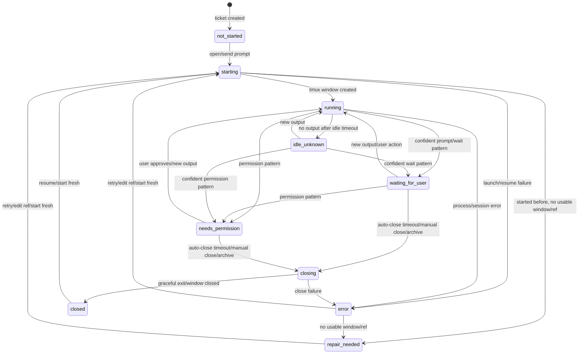
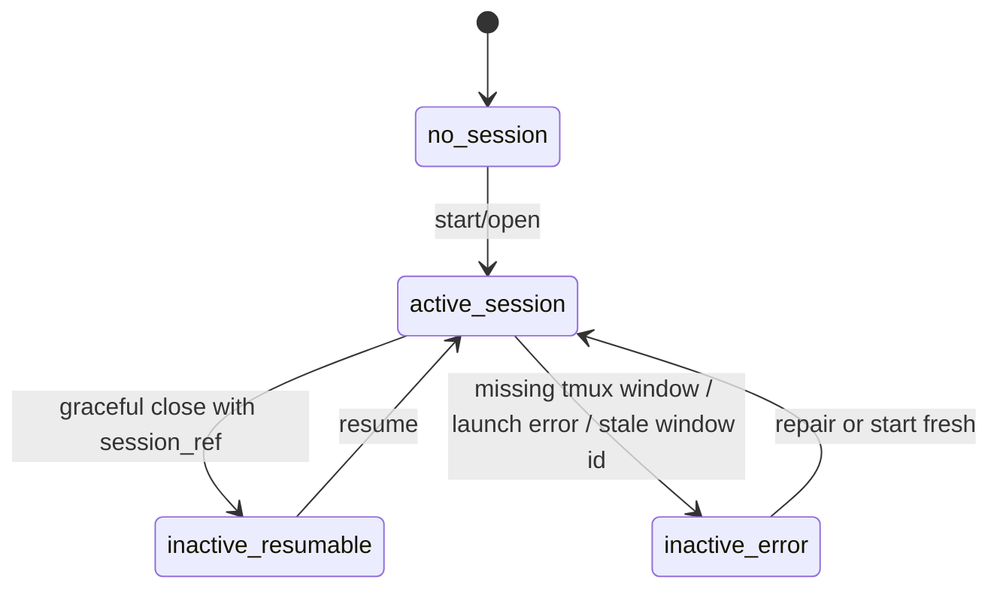
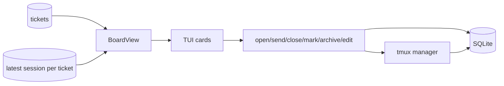
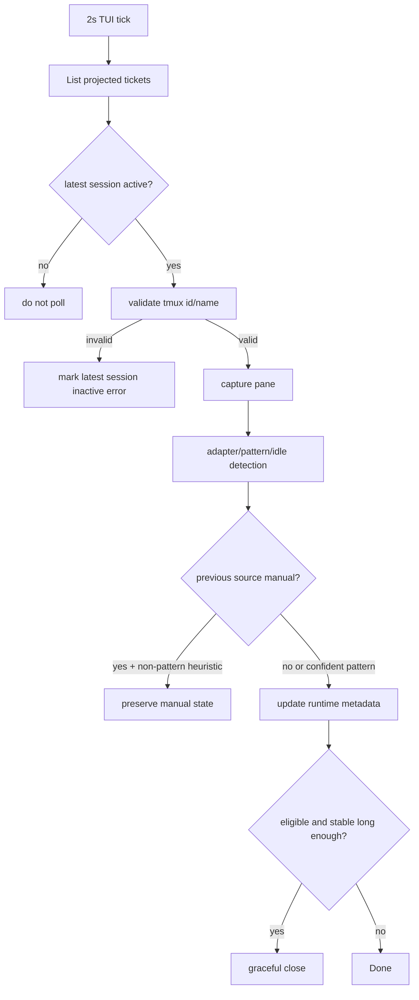
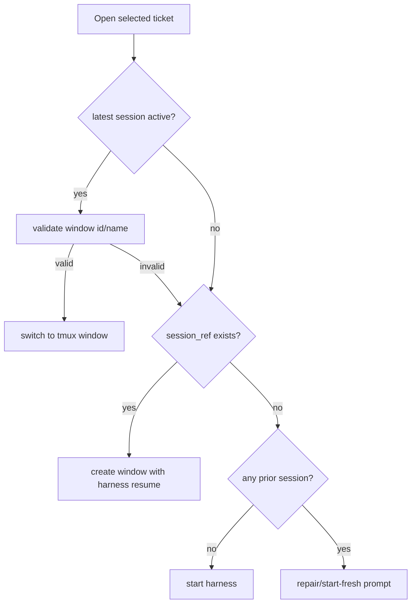
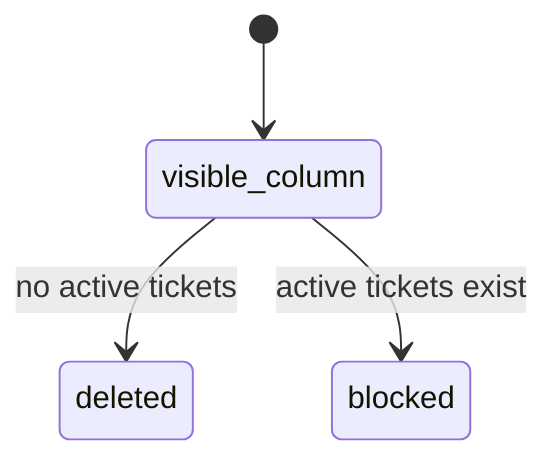

# Agent Kanban State Management

This document defines the state model the implementation should follow. SQLite is the canonical record; tmux is an observed runtime substrate; the TUI is a projection plus command surface.

## Runtime State Machine

## Session Activity Rules

- `sessions.is_active = 1` means the session is believed to have a live tmux window owned by the ticket.
- `sessions.is_active = 0` does not mean the ticket is `not_started`. The ticket should project the latest session's terminal state (`closed`, `error`, `exited`) and any `session_ref`.
- A tmux `window_id` is valid only if tmux still reports that id with the expected ticket window name. Window ids can be reused after windows close.
- Only one active session per ticket is allowed. Starting fresh deactivates the old active session and creates a new active session.

## Ticket Projection Data Flow

Projection rules:

- Tickets with no session project as `not_started`.
- Tickets with a latest active session project that session's runtime status and active tmux indicator.
- Tickets with a latest inactive session project that terminal status (`closed`, `error`, `exited`) and resumable/error indicator.
- Cards show active indicator only for active sessions with a validated tmux window.
- Cards show resumable indicator when no active window exists but a `session_ref` exists.
- Cards show error indicator for `error`.

## Runtime Watcher Data Flow

Watcher rules:

- Pattern detections (`waiting_for_user`, `needs_permission`, `error`) may overwrite manual state.
- Heuristics (`running`, `idle_unknown`, generic pane output) should not immediately overwrite a manual override.
- Auto-close should never trigger in the same tick that changes a ticket into an eligible state; timeout age starts at `last_state_change_at`.

## Open/Resume Data Flow

Open rules:

- Do not create a new DB session when merely switching to an already-active valid window.
- Do not trust stale tmux ids without name validation.
- If a previous session exists but no valid window/ref exists, show repair/start-fresh.
- `send prompt` is only valid for a never-started ticket.

## Column State Rules

- Column deletion is blocked by active tickets only, because archived tickets are not visible board cards.
- Archived tickets are preserved by moving them to a surviving column before deleting the column.

## Implementation Audit Notes

The current implementation is intentionally split this way:

- `internal/storage`: owns canonical ticket/session rows and the ticket projection used by `BoardView`.
- `internal/tmux`: owns tmux validation, start/resume/switch/close, runtime refresh, and repair errors.
- `internal/tui`: owns transient UI states such as edit mode, repair screen, prompt fallback, column edit, and manual mark menu.

State bugs to avoid:

- Do not derive ticket runtime from only active sessions. A closed or error latest session is still meaningful board state.
- Do not treat every latest session as active. `is_active` must be projected separately from `status`.
- Do not trust `tmux_window_id` without confirming tmux still reports the expected ticket window name for that id.
- Do not create a new DB session row just because a valid active ticket window was opened again.
- Do not let heuristic watcher output immediately overwrite a manual runtime override.
- Do not auto-close in the same tick that first detects a wait/permission state.
