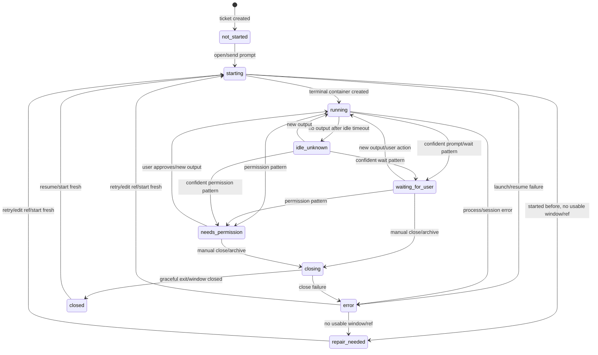
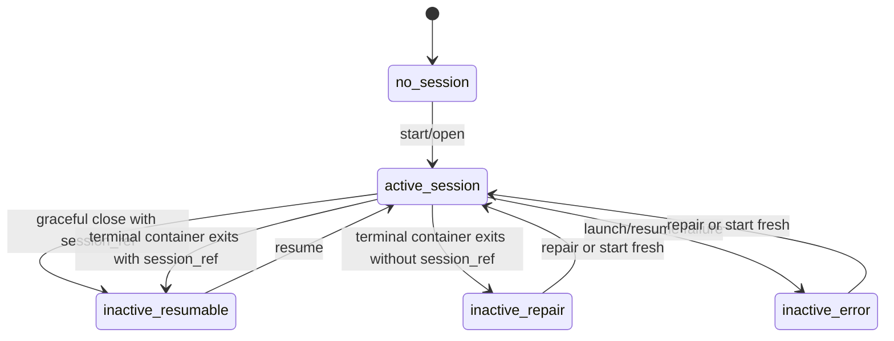
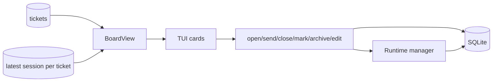
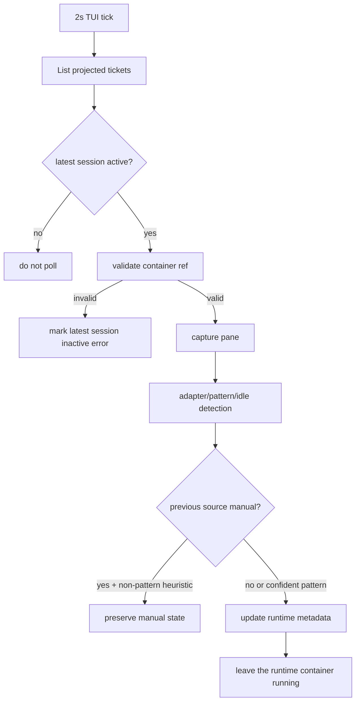
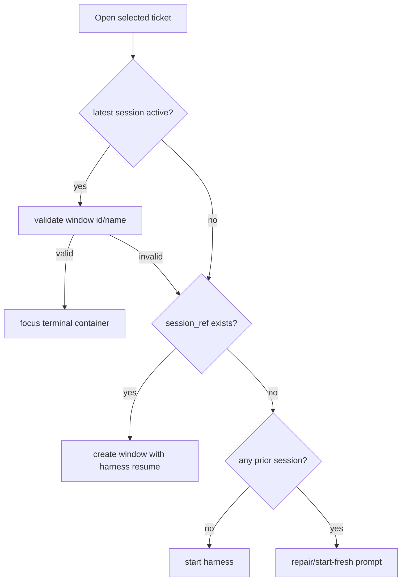
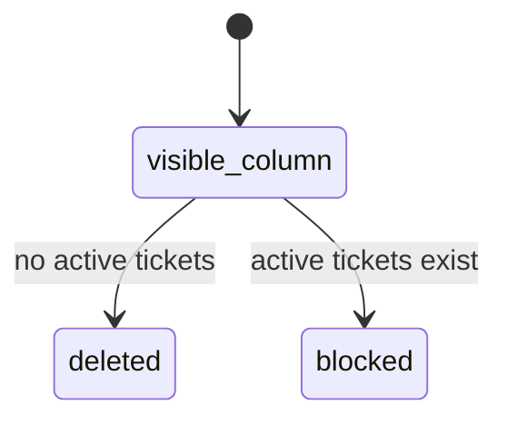

# Kanbi State Management

This document defines the state model the implementation should follow. SQLite is the canonical record; the configured multiplexer (tmux by default, Herdr when opted in) is an observed runtime substrate; the TUI is a projection plus command surface.

## Runtime State Machine

## Session Activity Rules

- `sessions.is_active = 1` means the session owns the ticket's single runtime slot. A `starting` row is a durable pre-launch claim and may not have a container reference yet; after launch it represents the live tmux window or Herdr agent/pane owned by the ticket. Sessions also snapshot nullable `workspace_id` and `launch_cwd`; all harness-ref capture, validation, recovery, and resume checks use that launch directory instead of assuming the board cwd.
- `sessions.is_active = 0` does not mean the ticket is `not_started`. The ticket should project the latest session's terminal state (`closed`, `error`, `exited`) and any `session_ref`.
- A tmux `window_id` is valid only if tmux still reports that id with the expected ticket window name. Name fallback must use the session row's stored `tmux_session_name`, not the current process's runtime session. Window ids can be reused after windows close. Herdr sessions store generic `multiplexer`, `mux_namespace`, `mux_container_id`, `mux_container_name`, and `mux_metadata` fields; Herdr-native agent status is authoritative when it is not `unknown`.
- Only one active session per ticket is allowed and SQLite enforces that invariant. Start/resume first writes a `starting` claim before launching a container, so concurrent Kanbi processes cannot both launch the same ticket. Starting fresh clears the prior attempt's legacy and generic runtime references in the lifecycle request, atomically deactivates the old active session, and creates the new claim in the currently configured multiplexer. tmux launches use the current executable's runtime tmux session; if a same-named tmux window already exists in that runtime session, the new window uses a unique suffix. Herdr launches use the configured Herdr session/workspace strategy.
- Launch, resume-liveness, persistence, and paste-prompt failures transition the claim to inactive `error`; any container created for the failed attempt is closed best-effort so it cannot remain untracked.
- A terminal container that disappears after a successful launch is not itself evidence of session failure. It becomes inactive `exited` when a verified harness session ref exists, or `repair_needed` when it does not. Legacy inactive `error` rows recorded specifically as a missing tmux window project the same way—`exited` with a ref and `repair_needed` without one—without rewriting session history.
- A multiplexer command failure alone is only an observation failure. When Herdr returns its explicit `agent_not_found` or `pane_not_found` code, however, that is authoritative container absence and follows the exited/repair rule above.
- Terminal transcript text such as `error:`, `failed`, a panic, or a traceback describes the agent's work and must not classify the harness session as `error`. Runtime observation/read failures preserve the last known lifecycle state and record the observation reason separately.

## Ticket Projection Data Flow

Projection rules:

- Tickets with no session project as `not_started`.
- Tickets with a latest active session project that session's runtime status and a validated-container indicator when one exists.
- Tickets with a latest inactive session project that terminal status (`closed`, `error`, `exited`) and resumability when a verified ref exists.
- Every card has one compact runtime row containing an icon, harness, textual runtime, and elapsed time when it fits. Text remains authoritative and color is supplemental: `·` is ordinary/inactive, `◐` is starting/closing, `●` is validated running, `?` is waiting, `!` is permission/repair, `◌` is idle, `○` is resumable, and `×` is non-resumable error.
- `●` is shown only for an active session with a validated terminal container. `○` is shown only when no active container exists and a verified `session_ref` does.
- Cards do not repeat normal container absence on a separate session line. The inspector and in-product `?` help provide the expanded semantics.
- Worktree-backed cards show one concise Git health row, prioritizing repair/conflict/cleanup state over dirty/divergence/mergeability details. The full branch name remains available in the ticket inspector.
- Board columns are responsive from a 30-cell minimum to a 44-cell maximum. Visible columns share a width and expand into available space; additional columns remain horizontally scrollable. Terminals narrower than 30 cells retain the minimum and clip rather than squeezing cards further.

## Runtime Watcher Data Flow

Watcher rules:

- Confident interaction patterns (`waiting_for_user`, `needs_permission`) may overwrite manual state. Transcript error text never changes the session lifecycle state to `error`.
- Heuristics (`running`, `idle_unknown`, generic pane output) should not immediately overwrite a manual override.
- Runtime refresh never closes a terminal container. Waiting and permission states remain active until an explicit close or archive action.

## Open/Resume Data Flow

Open rules:

- Do not create a new DB session when merely switching to an already-active valid window.
- Do not trust stale terminal container ids without multiplexer validation.
- If a previous session exists but no valid window/ref exists, show repair/start-fresh.
- `send prompt` is only valid for a never-started ticket.

## Execution Workspace Lifecycle

Boards choose `worktree_mode=off|git` at creation. Enabling Git worktrees on an existing board is an explicit, no-active-session migration; inactive legacy sessions remain historical and start fresh on first worktree open. After any workspace history exists, disabling is blocked so a board never mixes execution policies. The first start performs read-only repository/branch preflight, then a branch modal must be confirmed before either a workspace or session is created. SQLite records provisioning intent before `git worktree add`; ready workspaces are reused by resume and start-fresh attempts. Missing paths, repository identity changes, or branch mismatch transition a ready workspace to `repair_needed` and never fall back to the shared board directory.

Successful integration closes the agent, merges into the exact recorded source, marks the workspace integrated, and retires only its linked filesystem checkout. The local ticket branch, stable path, workspace row, and harness session ref remain current. Reopening rehydrates the checkout at the identical path and resumes the same harness session; subsequent commits can be integrated repeatedly. A missing path is expected only for an integrated workspace. Cleanup-required state remains current and actionable.

Git status is observed state stored as a bounded JSON snapshot; observation errors belong to the workspace and do not fail the harness session.

## Repository Integration Runs

Repository integration runs are durable repository-scoped operations, not synthetic tickets or ticket sessions. SQLite stores the exact source SHA, ordered selected workspace/branch SHAs, managed candidate checkout, runtime container reference, token hash, candidate report, and lifecycle (`planning`, `running`, `waiting_for_user`, `needs_permission`, `ready`, `blocked`, `promoting`, `promoted`, `failed`, or `cancelled`). Only one active run may target a Git common directory/source branch.

The integration agent works only in the candidate checkout and reports through the token-authenticated `kanbi integration report` command. Transcript text is never completion evidence. Promotion records durable `promoting` intent, revalidates source/candidate/item heads and clean worktrees after closing ticket agents, runs configured validation, and fast-forwards source once. Startup/retry reconciliation recognizes when source already equals the candidate and completes bookkeeping without repeating the merge. Active runs block board archive, export, and deletion.

## Board Data Lifecycle

- Active boards participate in the picker, Master aggregation, and provider sync. Archived boards retain their columns, tickets, notes, attachment ownership, provider identities, and every session row, but are excluded from normal views and sync.
- Archiving is blocked while any ticket session is active and atomically disables provider sync. Unarchiving does not re-enable sync; the user must do that explicitly.
- Permanent board deletion remains a separate, strongly confirmed operation. It removes the local aggregate and attachments but never deletes remote provider entities.
- Board packages are versioned, checksummed, path-safe exports of one complete board aggregate. Import always creates a new archived, sync-disabled board identity, remaps relational IDs transactionally, preserves history, and forces imported runtime attempts inactive without deleting their rows.
- Provider-linked note deletion retains an indefinite local tombstone. Sync cannot resurrect the note, and normal Kanbi deletion/archive operations never hard-delete remote issues or comments.

## Column State Rules

- Column deletion is blocked by active tickets only, because archived tickets are not visible board cards.
- Archived tickets are preserved by moving them to a surviving column before deleting the column.
- Ticket archival is rejected at the storage seam while a session is active. Lifecycle callers must successfully close the active runtime container before archiving; remote backend sync follows the same rule.

## Implementation Audit Notes

The current implementation is intentionally split this way:

- `internal/storage`: owns canonical ticket/session rows, ticket notes and deletion tombstones, per-board provider sync leases, remote push pending state tokens, redacted `runtime_diagnostics`, and the ticket projection used by `BoardView`. Linked-note tombstones are hidden from normal reads but visible to sync, preventing a still-present remote comment from being re-imported.
- `internal/ticketbackend`: owns startup/periodic/mutation-triggered provider sync, HTTP timeouts/retry class for reads, durable find-or-link create recovery, and sync diagnostic writes. Manager stop drains in-flight board syncs.
- `internal/tmux`: owns lifecycle orchestration, tmux validation, Herdr adapter dispatch, start/resume/switch/close, managed session-ref capture (cancel+WaitGroup), runtime refresh, and repair errors.
- `internal/tui`: owns transient UI states such as edit mode, repair screen, prompt fallback, column edit, manual mark menu, and bootstrap degraded banners (provider sync / runtime reconciliation). An open ticket editor snapshots the ticket identity it was opened for; refreshes may change the board projection and cursor position, but editor saves, notes, attachments, rendering, and external-editor results remain bound to that stable ticket ID.

State bugs to avoid:

- Do not derive ticket runtime from only active sessions. A closed or error latest session is still meaningful board state.
- Do not treat every latest session as active. `is_active` must be projected separately from `status`.
- Do not trust `tmux_window_id` without confirming tmux still reports the expected ticket window name for that id. Do not treat Herdr `unknown`/unavailable agent state as authoritative; fall back to pane-output/harness detection.
- Do not validate or control an existing active session against the current process's tmux session; use the stored `tmux_session_name` from the session row.
- Do not create a new DB session row just because a valid active ticket window was opened again.
- Do not let heuristic watcher output immediately overwrite a manual runtime override.
- Do not close sessions from runtime detection; wait/permission classification is advisory and may be imperfect.
- Do not infer session failure from errors printed in the agent transcript; only lifecycle/runtime operations can establish `error`.
- Do not turn a transient multiplexer read failure into a session error. Preserve the last known state and surface the observation failure as diagnostic context.
