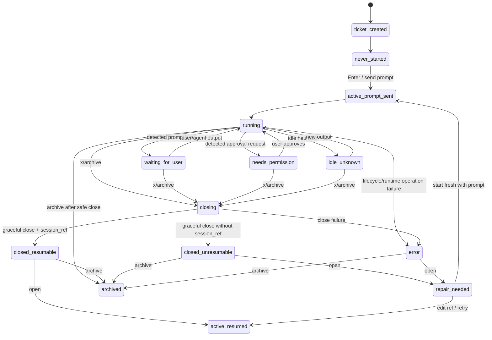
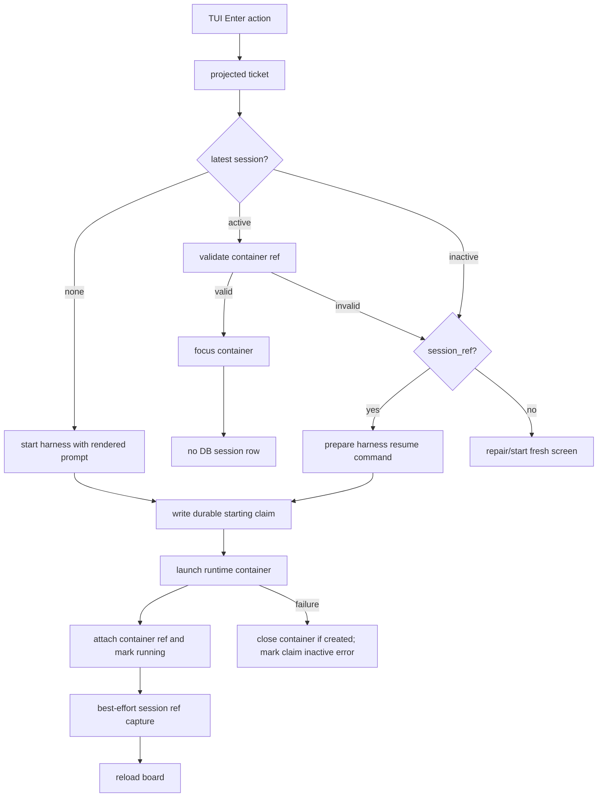

# Ticket And Session Lifecycle

This document specializes `docs/state-management.md` for ticket/session commands. The important separation is:

- A **ticket** is durable work metadata: title, body, harness preference, workflow column, archive status.
- A **session** is one attempt to run an agent for a ticket.
- A **runtime container** is the live process container for an active session. In tmux this is a window; in Herdr this is an agent/pane in a workspace.
- A **harness session ref** is the agent-native resume handle, when the harness exposes one.

## Lifecycle State Diagram

## Command Data Flow

## Harness Matrix

| Harness | Start, open-only | Start, send prompt | Resume | Prompt injection mode | Ref capture |
| --- | --- | --- | --- | --- | --- |
| Pi | `pi` | `pi <prompt>` plus bundled ref extension | `pi --session <ref>` | arg | extension handoff; fallback scan of `~/.pi/agent/sessions` |
| Codex | `codex --no-alt-screen` | `codex --no-alt-screen <prompt>` | `codex resume --no-alt-screen <ref>` | arg | scan `~/.codex/history.jsonl` for matching prompt |
| Copilot | `copilot` | `copilot -i <prompt>` | `copilot --resume=<ref>` | arg | query `~/.copilot/session-store.db` for matching cwd/prompt |
| Claude | `claude` | `claude <prompt>` | `claude --resume <ref>` | arg | scan `~/.claude/projects/**/*.jsonl` for matching cwd/prompt |
| Fake/smoke paste harness | configured command | start, wait for ready, multiplexer text send | configured resume | paste | parse terminal marker such as `SESSION_REF=` |

## Command Rules

### Git Worktree Preparation

When a board has explicitly enabled Git worktrees, the first `Enter` resolves the repository containing the board cwd, requires a non-detached source branch, records that branch and HEAD SHA, and opens an editable branch-name modal. Cancel is non-mutating. Existing branches and dirty source checkouts require explicit confirmation; branches already checked out elsewhere are rejected. The linked worktree is rooted at a stable board-UUID/ticket-ID path, while repository-subdirectory boards launch in the equivalent subdirectory. Later resume and start-fresh attempts reuse the current workspace.

### Send Prompt Semantics

For a never-started ticket, the default `Enter` action sends the prompt and opens the ticket:

- Allowed only when the ticket has never started.
- Uses the ticket body rendered as Markdown prompt.
- For arg-mode harnesses, append prompt to the harness command.
- For paste-mode harnesses, wait for prompt-ready, paste via tmux buffer, send Enter.
- Creates exactly one active session row. The row is claimed as `starting` before runtime launch and becomes `running` only after its container reference is persisted.
- Attempts harness-specific session ref capture. Delayed Pi/Claude capture is owned by the runtime manager and updates the exact session attempt that initiated it, even if a newer attempt becomes active before capture completes.
- If launch or prompt delivery fails, closes any newly-created container best-effort and leaves the attempt as an inactive `error` row.
- Delayed session-ref capture is bounded, attempt-bound, and canceled on manager shutdown.
- Workspace-backed attempts use the session's immutable launch-cwd snapshot for initial capture, delayed capture, validation, recovery, and resume.

### `Enter`: Default Ticket Action

- If the ticket has never started, send the rendered prompt and open the ticket.
- If the latest session is active and its stored multiplexer container validates, switch/focus it. Existing tmux sessions still validate in their stored `tmux_session_name`; Herdr sessions focus their stored agent/pane target.
- If the latest session is inactive and has a `session_ref`, resume it and create a new active session row.
- If the latest session is inactive and has no `session_ref`, show repair/start-fresh.
- Opening an already-active valid terminal container must not create a new session row.

### Repair

- `r` retries the open path.
- `e` edits the session ref, saves it, then tries to open/resume.
- `f` starts fresh with the rendered ticket prompt. The previous session history remains; legacy tmux and generic multiplexer references from that attempt are cleared from the new lifecycle request, and the new run becomes the only active session. It is launched through the currently configured multiplexer. tmux launches use the current executable's runtime tmux session and a separate window rather than reusing any existing same-named window; Herdr launches use the configured Herdr session/workspace strategy.
- `M` in the board view explicitly moves a tmux-backed ticket to the configured Herdr multiplexer when a harness session ref exists: Kanbi gracefully closes the active tmux window, then resumes the harness in a new Herdr pane/agent and stores that new container metadata. Without a session ref, use start-fresh instead.
- `c` cancels.

### Workspace Resolution And Local Integration

On a current workspace that is observed as conflicting, `r` closes the live agent before merging the latest recorded source branch into the ticket worktree, then resumes the same workspace with a conflict-file prompt that explicitly forbids merging into source. Conflicts remain isolated in the ticket worktree and project decisions can surface through normal needs-input state.

On a current workspace, `m` opens a textual confirmation showing source, ticket branch, and cached status. Confirmation revalidates clean checkouts and repository identity, serializes by Git common directory across Kanbi processes, closes the agent, merges only into the recorded source checkout, and removes the worktree/local branch only after success. Conflict or validation failure preserves the workspace; cleanup failure is recorded separately after a successful merge.

### Close / Archive

- Runtime detection never closes a session automatically. Waiting and permission classifications are advisory; the terminal container remains active until an explicit close or archive action.
- `x` sends harness exit keys first, waits for process/container exit, then closes the terminal container after timeout if needed.
- A successfully closed session is inactive and keeps its session ref if one was captured.
- If a successfully launched terminal container disappears outside the close command, the attempt becomes `exited` and resumable when it has a verified session ref; without a ref it becomes `repair_needed`. Missing containers are not labeled as session errors merely because the process exited.
- Agent transcript content never establishes session `error`: words such as `error`, `failed`, panic output, and tracebacks concern the work inside the session. Transient multiplexer read failures preserve the last known runtime state while recording diagnostic context; authoritative Herdr `agent_not_found`/`pane_not_found` responses establish that the container exited.
- Archiving a running ticket uses the same safe close path before hiding the ticket.

### Shutdown / interruption

- Process interrupt (`Ctrl+C` / SIGTERM) cancels Kanbi's root context. That drains manager-owned session-ref capture and provider sync; it does **not** kill active ticket agent sessions or flatten history.
- Pressing `q` exits the board UI the same way regarding agents: active ticket containers keep running until closed with `x`.
- Launch/resume/prompt failures leave at most one inactive `error` attempt and never delete prior session rows.
- Startup reconciliation errors are never discarded: Kanbi continues from SQLite in explicit **runtime reconciliation degraded (local data available)** mode with a durable diagnostic.

## Audit Findings Applied

- Copilot was previously configured like a paste-mode fake harness. Current Copilot CLI help exposes `-i <prompt>` for interactive prompt execution and `--resume=<id>` for resume, so the default adapter now uses arg mode through the `copilot` binary; session refs are captured from `~/.copilot/session-store.db` only after the first user turn matches the rendered prompt.
- Active vs inactive session state now controls whether terminal container metadata is trusted.
- A valid active open switches without writing a duplicate session row.
- Inactive latest sessions remain visible as `closed` or `error`, not `not_started`.
