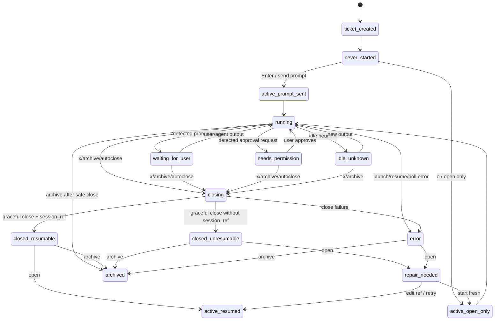
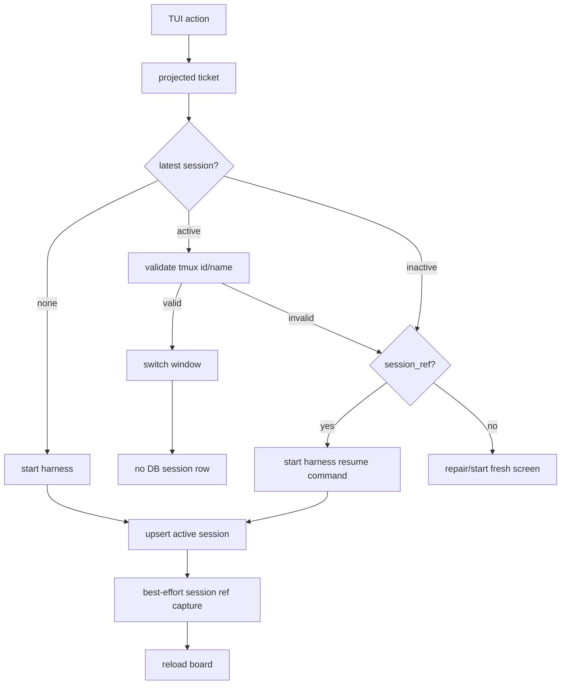

# Ticket And Session Lifecycle

This document specializes `docs/state-management.md` for ticket/session commands. The important separation is:

- A **ticket** is durable work metadata: title, body, harness preference, workflow column, archive status.
- A **session** is one attempt to run an agent for a ticket.
- A **tmux window** is the live process container for an active session.
- A **harness session ref** is the agent-native resume handle, when the harness exposes one.

## Lifecycle State Diagram

## Command Data Flow

## Harness Matrix

| Harness | Start, open-only | Start, send prompt | Resume | Prompt injection mode | Ref capture |
| --- | --- | --- | --- | --- | --- |
| Pi | `pi` | `pi <prompt>` | `pi --session <ref>` | arg | scan `~/.pi/agent/sessions` for matching prompt |
| Codex | `codex --no-alt-screen` | `codex --no-alt-screen <prompt>` | `codex resume --no-alt-screen <ref>` | arg | scan `~/.codex/history.jsonl` for matching prompt |
| Copilot | `gh copilot --` | `gh copilot -- -i <prompt>` | `gh copilot -- --resume=<ref>` | arg | query `~/.copilot/session-store.db` for matching cwd/prompt |
| Fake/smoke paste harness | configured command | start, wait for ready, tmux paste | configured resume | paste | parse pane marker such as `SESSION_REF=` |

## Command Rules

### Send Prompt Semantics

For a never-started ticket, the default `Enter` action sends the prompt and opens the ticket:

- Allowed only when the ticket has never started.
- Uses the ticket body rendered as Markdown prompt.
- For arg-mode harnesses, append prompt to the harness command.
- For paste-mode harnesses, wait for prompt-ready, paste via tmux buffer, send Enter.
- Creates exactly one active session row.
- Attempts harness-specific session ref capture.

### `o`: Open

- If the latest session is active and the tmux window validates in its stored `tmux_session_name`, switch to that window.
- If the latest session is inactive and has a `session_ref`, resume it and create a new active session row.
- If the latest session is inactive and has no `session_ref`, show repair/start-fresh.
- If no session exists, start open-only and create one active session row.
- Opening an already-active valid window must not create a new session row.

### `Enter`: Default Ticket Action

- If the ticket has never started, send the rendered prompt and open the ticket.
- If the ticket has any prior session, behave like `o`: open/switch/resume/repair according to the open rules above.

### Repair

- `r` retries the open path.
- `e` edits the session ref, saves it, then tries to open/resume.
- `f` starts fresh. The previous session history remains; the new run becomes the only active session and is launched in the current executable's runtime tmux session, in a separate tmux window rather than reusing any existing same-named window.
- `c` cancels.

### Close / Archive

- `x` sends harness exit keys first, waits for process/window exit, then closes the tmux window after timeout if needed.
- A successfully closed session is inactive and keeps its session ref if one was captured.
- Archiving a running ticket uses the same safe close path before hiding the ticket.

## Audit Findings Applied

- Copilot was previously configured like a paste-mode fake harness. Current Copilot help exposes `-i <prompt>` for interactive prompt execution and `--resume=<id>` for resume, so the default adapter now uses arg mode through `gh copilot --`; session refs are captured from `~/.copilot/session-store.db` when a matching cwd/prompt is found.
- Active vs inactive session state now controls whether tmux window metadata is trusted.
- A valid active open switches without writing a duplicate session row.
- Inactive latest sessions remain visible as `closed` or `error`, not `not_started`.
